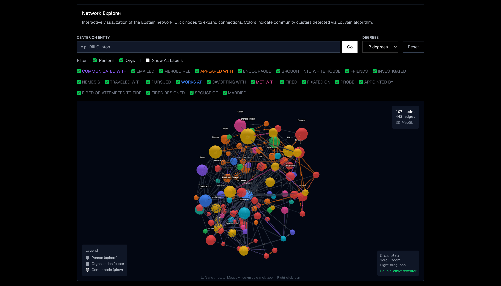
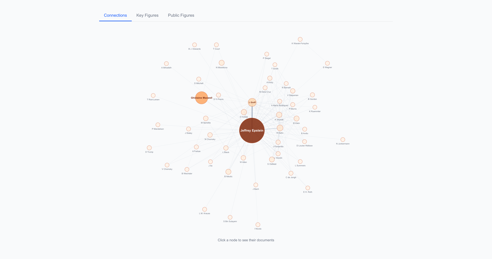
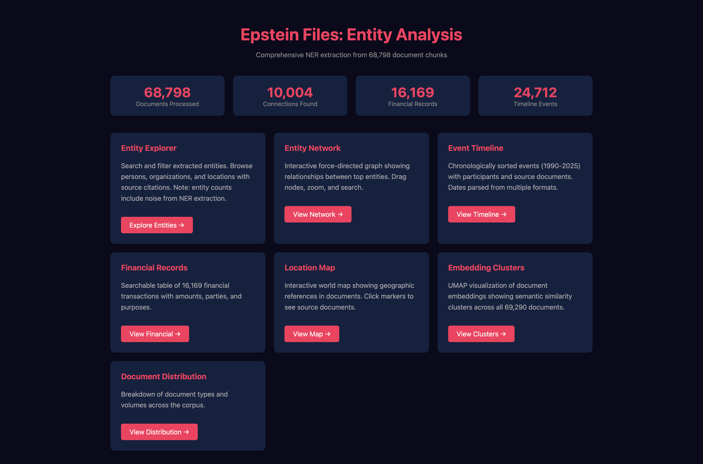
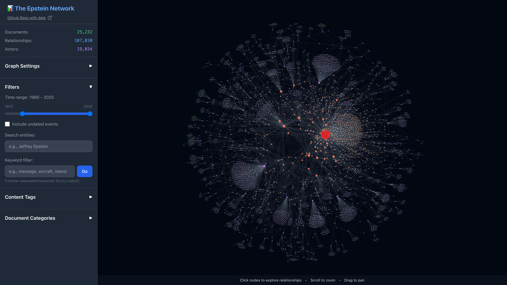
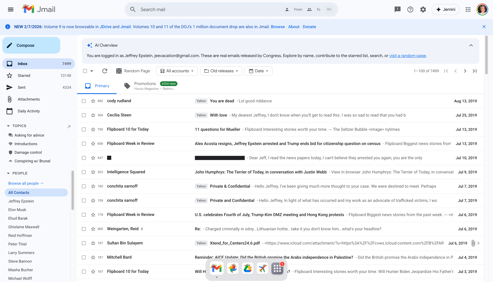
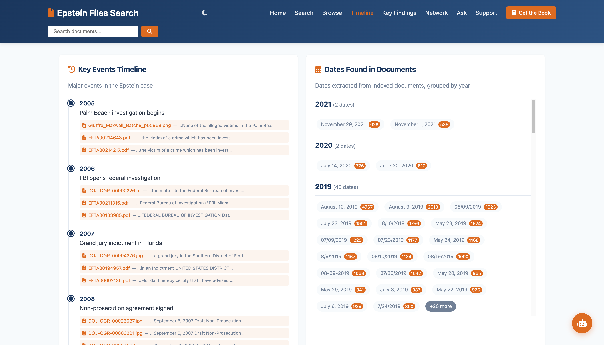
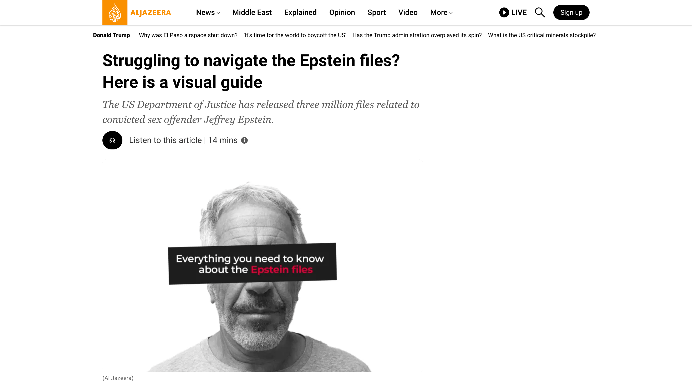

## エプスタイン・ファイル可視化コンテンツ：公式情報にもとづく解説

米国司法省や米下院監視政府改革委員会（House Oversight Committee）などが公開した Jeffrey Epstein（ジェフリー・エプスタイン）に関する文書群（通称「エプスタイン・ファイル」）を可視化・探索するための主要なプロジェクトについて、概要と見方をわかりやすく解説します。これらのコンテンツは2025年以降の公開データを元に構築されています。

<!-- more -->

## エプスタイン・ファイルとは何か？

「エプスタイン・ファイル」とは、ジェフリー・エプスタインに関連する捜査記録、証拠資料、電子メール、飛行記録、連絡帳、画像データなどの文書群を指す通称です。

これらは主に以下の主体によって公開されています。

- 米国司法省（DOJ）
- 米下院監視政府改革委員会

公開は一度きりではなく、複数回に分けて行われています。

---

## エプスタイン・ネットワーク・インデックス（SomaliScan）




### 誰が作ったか

SomaliScan は市民データ分析サイトとして運営されているプロジェクトです。その調査ツールとして公開されており、特定の個人名ではなく、サイト運営主体として情報が提供されています。

### どんな可視化がされているか

このツールは以下のような **ネットワーク可視化** を行います：

- Epsteinファイルに登場する人名・組織名をノードとして表現
- ドキュメント内での共出現（同じファイルで言及される関係）をエッジとして示す
- 人物・団体同士の関係性を階層的にレイヤー化して表示
- 政治献金、連邦助成金などの政府資金データとの交差参照も行い、関連の可能性を検討する機能を備えています。

### 見方のポイント

1. **ノード＝人物・組織**  
   ノードの大きさはその人物・組織が文書内でどれだけ頻繁に登場するかを示します。

2. **エッジ＝共出現**  
   エッジはただ同じファイル内に名前があるだけで必ずしも実際の関係性を証明するものではありません。

3. **政府データとの交差参照**  
   政治献金や連邦助成金のような政府データを重ねることで、文書情報だけでは見えにくい背景を視覚化します。

4. **因果関係ではない**  
   類似の出現があっても、それ自体が実際の関係性や不正行為を示すわけではありません。必ず元の公的資料や証拠に遡る必要があります。

---

## エプスタイン・グラフ（EpsteinGraph）




### 誰が作ったか

EpsteinGraph は独立した開発者によって運営されているオンライン・アーカイブおよび探索ツールです。複数の公式公開資料を一つにまとめ、インタラクティブに検索・可視化できるように設計されています。

### どんな可視化がされているか

このサイトでは以下の機能が提供されています：

- **関係性ネットワーク**：人物・組織・場所などの関係図
- **タイムライン**：文書の日付を元にした時間的なイベント表示
- **全文検索**：公開ファイル群に対するキーワード検索
- **メディア・視覚資料の表示**：画像やビデオなどもインタラクティブに扱える機能　など

このように、インデックス化されたドキュメントを視覚的・時間軸的に探索することで、文書群が持つ構造を理解しやすくしています。

### 見方のポイント

1. **ネットワークは「探索の入口」**  
   グラフは関連性の強さを見る手段ですが、必ず元の文書（PDF・法廷記録など）に戻って内容を確認することが重要です。

2. **タイムラインで背景理解**  
   文書に含まれる日付情報を元に時系列で事件全体像を把握できます。

3. **検索と検証**  
   特定の人物・単語で検索し、出現箇所を確認することで事実関係の裏付けが可能です。

---

## Epstein Files Visualizations（SvetimFM）




### 誰が作ったか

GitHub 上で公開されているオープンソース・プロジェクトで、**SvetimFM** という個人によって作られています。公式の公開ドキュメントを元に可視化や統計解析が行われています。

### どんな可視化がされているか

主に機械学習を用いた分析・可視化が中心です：

- **UMAP埋め込み**：文書全体の類似性を2次元マップ上にプロット
- **ネットワーク図**：名前・団体の共出現ネットワーク
- **文書構成分布**：テキストと画像の割合や文書タイプ別分布
- **RAG（検索強化生成）レポート**：自動抽出による解説や統計情報

これらはドラッグ＆ドロップ型ではなく、Webブラウザ上でインタラクティブに操作できる可視化ツールです。

### 見方のポイント

1. **埋め込み図**  
   類似した文書が近くに配置されるので、特定のテーマや内容ごとのグルーピングを直感的に理解できます。

2. **クラスタリング**  
   エンティティをクラスタ化することで、どのグループが同じ文脈で現れているか把握できます。

3. **可視化は補助**  
   機械学習の解析は元データを平易化するための手段であり、一次資料の検証が不可欠です。

---

## Epstein Visualizer




### 誰が作ったか

GitHub で公開されているネットワーク可視化インターフェースです。文書セットから抽出された関係性を **力学的ネットワーク図** として表現します（D3.js 等のライブラリ使用）。

### どんな可視化がされているか

- **Force-Directed Graph（物理力学ネットワーク）**
- クリックすると元の文書へのリンクを表示
- フィルタや時間ごとの切り替え機能

この可視化は「誰が誰とどの文書内で関係しているか」を参照付きで直感的に示すものとして設計されています。

### 見方のポイント

1. **インタラクティブ探索**  
   ノードをクリックすることで、出現元の文書ページを読み込み、文脈を確認できます。

2. **時間フィルタ**  
   時期を絞ることで、事件の進展や人物の関与期間を把握できます。

3. **ネットワークの役割**  
   あくまで探索補助なので、ネットワークだけで結論を導くのではなく必ず一次文書から検証してください。

---

## Jmail — Jeffrey Epstein's Emails




### 作者
公式サイト（https://jmail.world/）上では、特定の実名個人ではなく「Jmail」という名称で公開されています。トップページおよびフッター記載からは、エプスタイン関連メールの閲覧・検索を目的とした独立系プロジェクトであることが読み取れます。

### どんな可視化がなされているか
Jmailは、公開されたエプスタイン関連メールを、実際の「受信箱」風インターフェースで再構成するという視覚的アプローチを取っています。主な特徴は以下の通りです。

- メール一覧ビュー（送信者・件名・日付）
- 個別メールの全文表示
- 送信者・受信者ごとのフィルタリング
- キーワード検索機能

グラフ理論的なネットワーク図ではなく、「UIを模した再配置」による体験型可視化です。閲覧者は、メールのやり取りを時系列や差出人単位で追うことができます。

### 記事・サイト内で述べられていること
サイト上では、公開済みのエプスタイン関連文書のうち電子メールを中心に整理している旨が説明されています。一次資料を検索しやすくすることを目的としており、独自解釈よりも「閲覧性の向上」に重点を置いている構成です。

---

## EpsteinScan – Search the Epstein Files




### 作者
公式サイト（https://www.epsteinscan.org/）上の記載では、エプスタイン関連文書を横断検索できる独立プロジェクトとして公開されています。サイト上では検索エンジンとしての機能説明が中心で、特定の報道機関によるものではありません。

### どんな可視化がなされているか
EpsteinScanは、文書群を全文検索可能なデータベースとして構造化しています。

- キーワード検索
- 文書プレビュー表示
- メタデータ（文書種別・日付等）表示
- 文脈表示（検索語前後の抜粋）

視覚的なネットワーク図ではなく、「検索UIの高度化」による情報整理型の可視化です。大量のPDF・証言録などを横断的に検索できる点が特徴です。

### 記事・サイト内で述べられていること
公開済みエプスタイン文書を横断的に検索可能にすることが目的であると明記されています。利用者が一次資料に直接アクセスし、自身で確認できる環境を提供する設計です。

---

## Al Jazeera  
### Struggling to navigate the Epstein files? Here is a visual guide




### 作者
報道機関は Al Jazeera です。記事は同社ニュース部門によるインフォグラフィック解説です。

### どんな可視化がなされているか
記事内では以下のようなビジュアル要素が用いられています。

- 人物相関図（エプスタインと関連人物）
- タイムライン（主要事件の時系列整理）
- 文書分類図（公開資料の種類別整理）
- フライト記録や法廷資料の図解

ネットワーク図・時系列図・カテゴリ分解図を組み合わせたニュース向けインフォグラフィック構成です。

### 記事中で述べられていること
記事では、公開されたエプスタイン関連資料が膨大かつ複雑であることを前提に、以下の点を整理しています。

- 主要人物の関係性
- 司法手続きの流れ
- 公開文書の構成
- 誤情報や憶測との区別

一次資料への導線を示しつつ、読者が全体像を把握できる構成になっています。

---

## Reuters  
### Photos from the Epstein files release - December 21, 2025




### 作者
報道機関は Reuters です。

### どんな可視化がなされているか
写真ギャラリー形式で以下を提示しています。

- 公開資料の実物写真
- 文書ページの拡大画像
- 公開現場の様子

これはネットワーク分析ではなく、「一次資料そのものの視覚提示」です。

### 記事中で述べられていること
記事は2025年12月21日に公開された文書群の写真記録を掲載しています。解説は最小限で、資料そのものの視覚的提示に重点があります。

---

## 参考・出典

- [Epstein Network Index | SomaliScan](https://www.somaliscan.com/investigation/epstein-index)
- [Epstein Graph – Best Practices](https://epsteingraph.com/best-practices)
- [Epstein Files Visualizations](https://svetimfm.github.io/epstein-files-visualizations/)
- [epstein visualizer](https://epsteinvisualizer.com/)
- [Jmail — Jeffrey Epstein's Emails](https://jmail.world/)
- [EpsteinScan – Search the Epstein Files](https://www.epsteinscan.org/)
- [Struggling to navigate the Epstein files? Here is a visual guide | Infographic News | Al Jazeera](https://www.aljazeera.com/news/2026/2/10/struggling-to-navigate-the-epstein-files-here-is-a-visual-guide)
- [Photos from the Epstein files release - December 21, 2025 | Reuters](https://www.reuters.com/pictures/photos-epstein-files-release-2025-12-21/)

